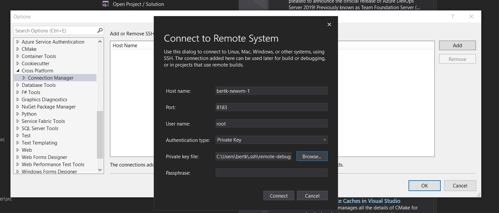
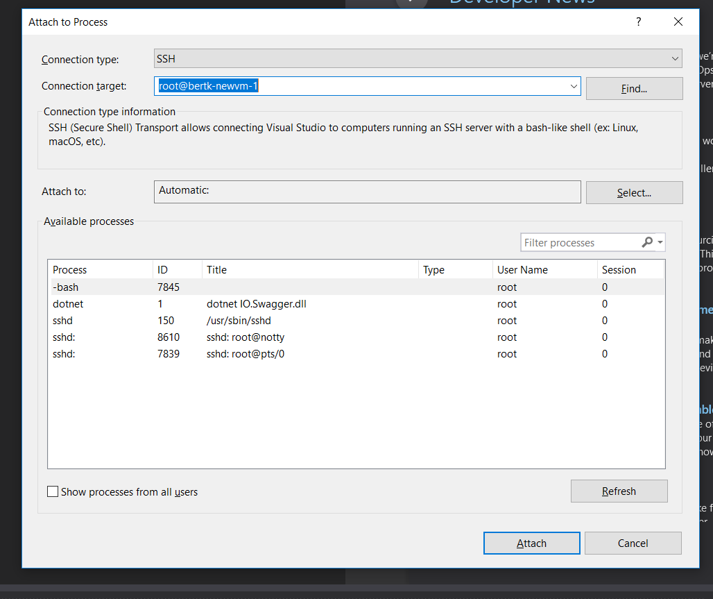

# Remote debugging C and C# containers in Visual Studio 2017

Since Horton runs (almost) all code that is being tested inside of Docker containers, it is useful to be able to remotely debug code that runs inside of containers.  This procedure specifically involves using a Windows install of Visual Studio 2017 to debug the C or C# wrapper inside of a Linux container.

## when is this useful?

This is useful for:
1. Catching exceptions inside of tests inside of debuggers
2. Tracing through C/C# SDK code or C/C# glue code

## Step 1: Get SSH key and source

Instructions for this are in [remote-debug-setup.md](/devdocs/remote-debug-setup.md)

When you are completed with these steps, you should be able to SSH into your module container via your host machine (as opposed to your local VM, which the container is running on). 

## Step 2: Install GDB dDebug extension

For C, you need to install the [Visual C++ for IoT Development](https://marketplace.visualstudio.com/items?itemName=MarcGoodner-MSFT.VisualCforIoTDevelopment) into your Visual Studio 2017 install

For C#, you don't need to install anything extra.

## Step 2: Set up an SSH connection for Visual Studio

In this step, we take the host name, port, and SSH key that we got in Step 1 and put them into Visual Studio

1. On Visual Studio, select `Tools`->`Options`.
2. In the Options page, select `Cross Platform`->`Connection Manager` on the left.
3. Click `Add`, then enter the following values:
* `Host Name`: The name of your linux VM.
* `Port`: The SSH port for your container (from step 1)
* `User nane`: `root`
* `Authentication type`: `Private Key`
* `Private key file`: The private key file for your container (from step 1)

**`If you see an error titled `Downloading and updating headers for IntelliSense`**: Hit `Close`.  It's OK to ignore this.

## Step 3: Attach to the running process

1. In Visual Studio, select `Debug`->`Attach to Process`
2. In the `Attach to Process` dialog, select `Connection Type` = `SSH`
3. In the `Connection target` dropdown, select the SSH connection you created in Step 2

4. Select the process with ID = 1 and click "Attach"
5. In the `Select Code Type` dialog, select `Native (GDB)` for C or `Managed (.Net Core for Unix)` for C#

6. You should see output in the Debug pane if you're successful.
7. Break into the debugger.
    1. If it asks you to find source, find the file (probably `/wrapper/Program.cs`) in the source that you downloaded in step 1.
    2. If it doesn't ask you to find source, click the stack frame at the bottom of the stack (probably `/wrapper/Main.cpp`) and find that file in the source you downloaded in step 1.

After this, you can press F5 to continue and debug as usual (set breakpoints, etc)
