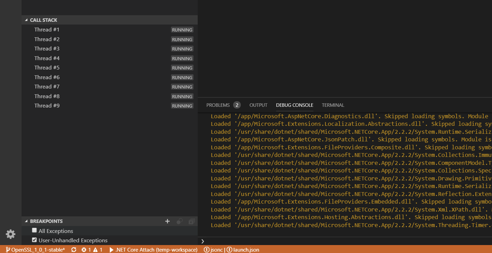

# Remote debugging C# containers in Visual Studio Code

Since Horton runs (almost) all code that is being tested inside of Docker containers, it is useful to be able to remotely debug code that runs inside of containers.  This procedure specifically involves using a Windows install of Visual Studio Code to debug the C# wrapper inside of a Linux container.

## when is this useful?

This is useful for:
1. Catching exceptions inside of tests inside of debuggers
2. Tracing through C# SDK code or C# glue code

## Step 1: Get SSH key and source

Instructions for this are in [remote-debug-setup.md](/remote-debug-setup.md)

## Step 2: Install VSCode prerequisites

Install the `ms-vscode.csharp` extension into vscode which will allow you to debug.

## Step 3: create VSCode debugger config to connect remotely
Inside VSCode, open `.vscode/launch.json` and add the following.  Replace the following values:
* `YOUR_VM_NAME`: This is the hostname for your VM
* `YOUR_CONTAINER_PORT`": This is the port you got from `docker ps` above (`8183` in my example)
* `HORTON_ROOT_PATH`: This is a pointer to your local copy of Horton so it can find the glue source files.

```
{
    // Use IntelliSense to learn about possible attributes.
    // Hover to view descriptions of existing attributes.
    // For more information, visit: https://go.microsoft.com/fwlink/?linkid=830387
    "version": "0.2.0",
    "configurations": [
        {
            "name": ".NET Core Attach",
            "type": "coreclr",
            "request": "attach",
            "processId": "1",
            "pipeTransport": {
                "pipeProgram": "ssh",
                "pipeArgs": ["-T", "root@YOUR_VM_NAME", "-p", "YOUR_CONTAINER_PORT"],
                "debuggerPath": "/vsdbg/vsdbg",
            },
            "sourceFileMap": {
                "/wrapper": "PATH/csharp_source/wrapper",
                "/sdk": "PATH/csharp_source/sdk",
            }
        }
    ]
}
```


## Step 6: Attach your debugger to the container

In vscode, press F5 to start the debugger.  If it all works, you should start seeing debug output in the terminal at the bottom.



## Step 7: Launch your tests

You probably do this using a bash prompt on your Linux VM.  As the test is running inside your bash window, you should see debug output in your vscode debugger window.  This is how you know it's running.

**(one possible) command to use**: `pytest --csharp-wrapper --scenario=edgehub_module_client`

**Example output**:
```
(Python-3.6.6) bertk@bertk-newvm-1:~/repos/e2e-fx/test-runner$ pytest --csharp-wrapper --scenario=edgehub_module_client
=================================== test session starts ===================================
platform linux -- Python 3.6.6, pytest-3.8.2, py-1.6.0, pluggy-0.8.1 -- /home/bertk/env/Python-3.6.6/bin/python3
cachedir: .pytest_cache
rootdir: /home/bertk/repos/e2e-fx/test-runner, inifile: pytest.ini
plugins: timeout-1.3.2, testdox-1.0.1, repeat-0.7.0, mock-1.10.0, cov-2.6.0, asyncio-0.10.0
timeout: 90.0s
timeout method: signal
timeout func_only: False
collecting 44 items
Using mqtt
Using csharp wrapper
```
