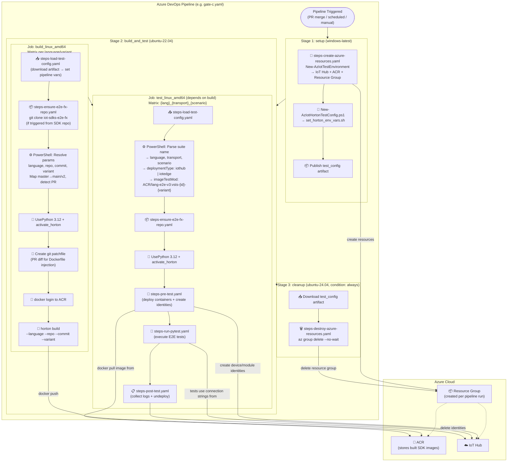
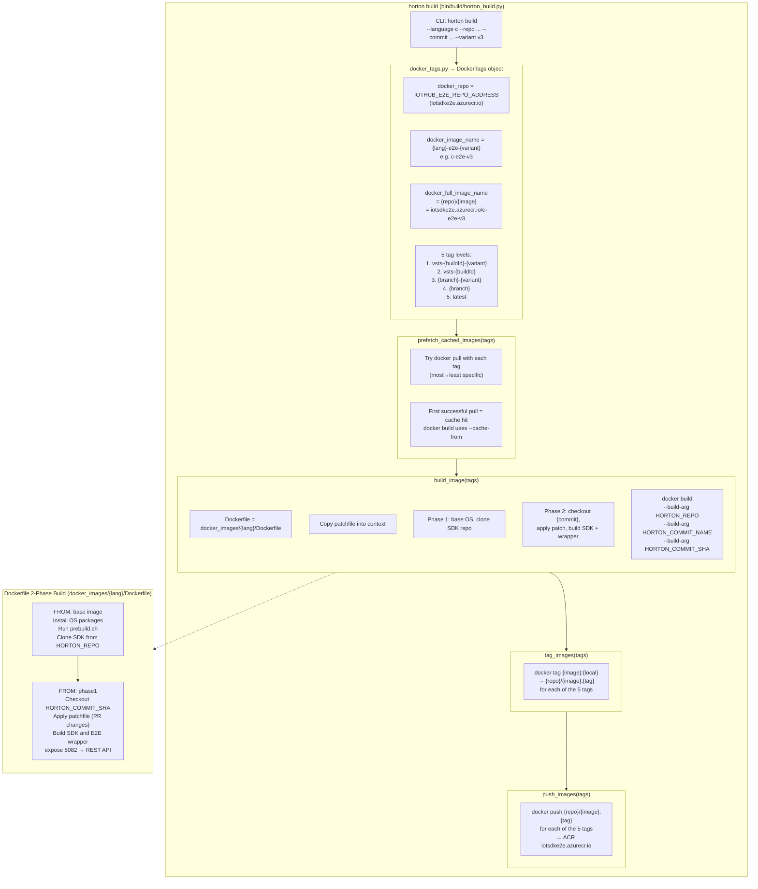
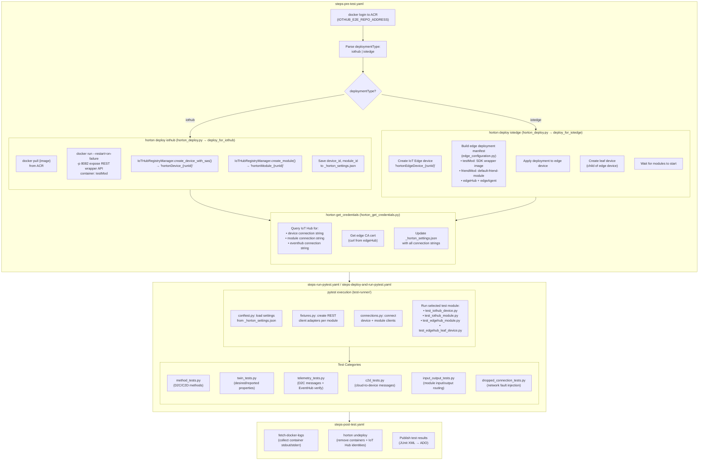
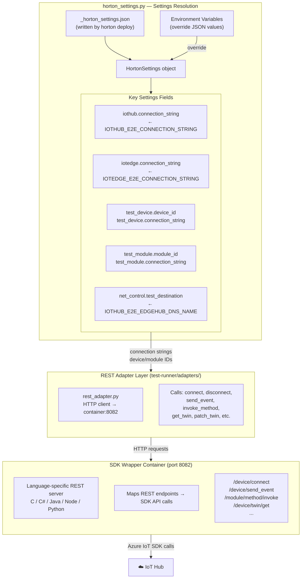

# Horton E2E Testing Framework — Architecture

## 1. Pipeline-Level Architecture

### Overview

Each SDK gate pipeline (e.g. `gate-c.yaml`, `gate-node.yaml`) follows a **3-stage architecture**:

| Stage | Pool | Purpose |
|-------|------|---------|
| `setup` | windows-latest | Create Azure resources (IoT Hub, ACR, Resource Group) dynamically |
| `build_and_test` | ubuntu-22.04 | Build SDK wrapper Docker image, push to ACR; then pull image, deploy containers, run E2E tests |
| `cleanup` | ubuntu-24.04 | Destroy the Azure resource group (runs `always()`, even on failure) |

Per-language gates (e.g. `gate-c.yaml`) delegate the build & test jobs to template files (`vsts/templates/jobs-gate-{lang}.yaml`).

### Dynamic Resource Provisioning

The `setup` stage runs `steps-create-azure-resources.yaml`, which:

1. Downloads `Azure.Iot.Sdk.Test.psm1` (shared test infrastructure module)
2. Downloads `New-AzIotHortonTestConfig.ps1` (Horton-specific config generator)
3. Calls `New-AzIotTestEnvironment` via Azure CLI to create an IoT Hub and ACR in a new resource group
4. Calls `New-AzIotHortonTestConfig` to generate `set_horton_env_vars.sh` with all connection strings
5. Publishes the `test_config` artifact

The `build_and_test` stage uses `steps-load-test-config.yaml` at the start of each job to:

1. Download the `test_config` artifact
2. Source `set_horton_env_vars.sh`
3. Set pipeline variables as secrets via `##vso[task.setvariable]`

**Secret variables** provisioned dynamically per pipeline run:

| Variable | Purpose |
|----------|---------|
| `IOTHUB-E2E-CONNECTION-STRING` | IoT Hub service connection string for creating device/module identities |
| `IOTHUB-E2E-EVENTHUB-CONNECTION-STRING` | Event Hub-compatible connection string for telemetry verification |
| `IOTHUB-E2E-REPO-ADDRESS` | ACR login server hostname |
| `IOTHUB-E2E-REPO-USER` | ACR username |
| `IOTHUB-E2E-REPO-PASSWORD` | ACR password |

---

## 2. Docker Build Process

### Tag Computation (`docker_tags.py`)

The `DockerTags` class computes 5 tags per image, ordered from most to least specific:

| # | Tag Pattern | Example | Purpose |
|---|------------|---------|---------|
| 1 | `vsts-{buildId}-{variant}` | `vsts-12345-v3` | Exact build + variant match |
| 2 | `vsts-{buildId}` | `vsts-12345` | Exact build, any variant |
| 3 | `{branch}-{variant}` | `main-v3` | Branch + variant cache |
| 4 | `{branch}` | `main` | Branch-level cache |
| 5 | `latest` | `latest` | Fallback cache |

### Cache Prefetch Strategy

`prefetch_cached_images()` iterates through all 5 tags attempting `docker pull`. The first successful pull provides a `--cache-from` argument to `docker build`, significantly reducing build time for incremental changes.

### 2-Phase Dockerfile

Each language's Dockerfile under `docker_images/{lang}/Dockerfile` uses a 2-phase build:

| Phase | Actions |
|-------|---------|
| **Phase 1** | Install base OS packages, run `prebuild.sh`, clone the SDK repo from `HORTON_REPO` |
| **Phase 2** | Checkout `HORTON_COMMIT_SHA`, apply the patchfile (PR diff), build the SDK and E2E REST wrapper, expose port 8082 |

The patchfile allows testing PR changes that haven't been merged yet — the pipeline generates a diff between the PR branch and the target branch and injects it into the Docker build context.

---

## 3. Test Deployment & Execution Flow

### Deployment Types

#### IoT Hub Deployment (`horton deploy iothub`)

Used for scenarios: `iothub_device`, `iothub_module`

1. Pull the SDK wrapper image from ACR
2. Run as a local Docker container (`testMod`) with port 8082 exposed
3. Create a device identity (`hortonDevice_{runId}`) in IoT Hub via `IoTHubRegistryManager`
4. Create a module identity (`hortonModule_{runId}`) under that device
5. Save identifiers to `_horton_settings.json`

#### IoT Edge Deployment (`horton deploy iotedge`)

Used for scenarios: `edgehub_module`, `edgehub_leaf_device`

1. Create an IoT Edge device identity (`hortonEdgeDevice_{runId}`)
2. **Pre-create module identities** (`testMod`, `friendMod`) in IoT Hub _before_ applying the deployment — this ensures EdgeHub's `DeviceScopeIdentitiesCache` finds them on its initial scope fetch at startup, avoiding the 120-second refresh cooldown
3. Build a deployment manifest with 4 modules:
   - `testMod` — the SDK wrapper image being tested
   - `friendMod` — a companion module (`default-friend-module`) for module-to-module tests
   - `edgeHub` — the IoT Edge Hub runtime module
   - `edgeAgent` — the IoT Edge Agent runtime module
4. Apply the deployment to the edge device
5. Create a leaf device (non-edge device, child of the edge device)
6. Wait for all modules to reach running state
7. **Restart EdgeHub** for a fresh scope sync — ensures newly-created identities are visible to EdgeHub before tests begin

### Credential Retrieval (`horton get_credentials`)

After deployment, `horton_get_credentials.py` queries IoT Hub for:
- Device connection string
- Module connection string
- EventHub-compatible connection string (for telemetry verification)
- Edge CA certificate (for edge scenarios, fetched via curl from edgeHub)

All credentials are written to `_horton_settings.json`.

### Test Execution

Tests run via **pytest** from the `test-runner/` directory. The test matrix determines which test module runs:

| Test Module | Scenario |
|-------------|----------|
| `test_iothub_device.py` | IoT Hub device client tests |
| `test_iothub_module.py` | IoT Hub module client tests |
| `test_edgehub_module.py` | Edge Hub module client tests |
| `test_edgehub_leaf_device.py` | Edge Hub leaf device tests |

Each test module imports test mixins from shared files:

| Test File | What It Tests |
|-----------|---------------|
| `method_tests.py` | Device/module direct methods (D2C and C2D) |
| `twin_tests.py` | Device twin desired/reported property operations |
| `telemetry_tests.py` | D2C messages with EventHub verification |
| `c2d_tests.py` | Cloud-to-device messages |
| `input_output_tests.py` | Module input/output message routing |
| `dropped_connection_tests.py` | Network fault injection + reconnection |

### Post-Test Cleanup

1. **Fetch Docker logs** — collects stdout/stderr from all test containers
2. **Undeploy** — removes Docker containers and deletes IoT Hub device/module identities
3. **Publish results** — uploads JUnit XML to Azure DevOps for test reporting

---

## 4. Settings & REST Adapter Architecture

### Settings Resolution

The `HortonSettings` class in `horton_settings.py` loads configuration in two layers:

1. **JSON file** (`_horton_settings.json`) — written by `horton deploy` and `horton get_credentials` with device IDs, connection strings, and deployment details
2. **Environment variables** — override any JSON values; used for pipeline-injected secrets

| Settings Field | Environment Variable Source |
|---------------|---------------------------|
| `iothub.connection_string` | `IOTHUB_E2E_CONNECTION_STRING` |
| `iotedge.connection_string` | `IOTEDGE_E2E_CONNECTION_STRING` |
| `net_control.test_destination` | `IOTHUB_E2E_EDGEHUB_DNS_NAME` |
| `test_device.device_id` | Written by `horton deploy` |
| `test_device.connection_string` | Written by `horton get_credentials` |
| `test_module.module_id` | Written by `horton deploy` |
| `test_module.connection_string` | Written by `horton get_credentials` |

### REST Adapter Pattern

Horton uses a **language-agnostic REST adapter pattern** to test all SDKs through a uniform interface:

1. **Test Runner** (Python pytest) makes HTTP calls via `rest_adapter.py`
2. **SDK Wrapper Container** (one per language) listens on port **8082** and translates REST calls to native SDK API calls
3. This allows the same pytest test suite to run against any SDK language

Key REST endpoints exposed by each wrapper:

| Endpoint | SDK Operation |
|----------|--------------|
| `PUT /device/connect` | Initialize device client with connection string |
| `PUT /device/disconnect` | Close device client connection |
| `PUT /device/send_event` | Send D2C telemetry message |
| `PUT /module/method/invoke` | Invoke a direct method on a module |
| `GET /device/twin` | Get device twin |
| `PATCH /device/twin` | Update reported properties |
| `PUT /device/enableMethods` | Enable direct method handler |
| `PUT /device/enableC2d` | Enable C2D message handler |

---

## Key File Reference

| File | Purpose |
|------|---------|
| `bin/horton.py` | CLI entry point for all `horton` commands |
| `bin/build/horton_build.py` | Orchestrates docker build/tag/push |
| `bin/build/docker_tags.py` | Computes image names and tag hierarchy |
| `bin/deploy/horton_deploy.py` | Deploys containers + creates IoT Hub identities |
| `bin/deploy/horton_get_credentials.py` | Fetches connection strings from IoT Hub |
| `bin/deploy/horton_undeploy.py` | Cleans up containers + identities |
| `bin/deploy/edge_deployment.py` | Builds IoT Edge deployment manifests |
| `bin/deploy/edge_configuration.py` | Configures edge module settings + registry creds |
| `bin/deploy/utilities.py` | Docker + shell helper functions |
| `horton_helpers/src/horton_settings.py` | Settings management (JSON + env vars) |
| `docker_images/{lang}/Dockerfile` | 2-phase Dockerfile per SDK language |
| `scripts/New-AzIotHortonTestConfig.ps1` | Generates `set_horton_env_vars.sh` from Azure resources |
| `test-runner/conftest.py` | pytest configuration + settings loading |
| `test-runner/fixtures.py` | pytest fixtures for REST client adapters (with retry logic) |
| `test-runner/connections.py` | Client connection management |
| `test-runner/adapters/` | REST adapter implementations |
| `vsts/gate-{lang}.yaml` | Per-language gate pipeline definitions (3-stage) |
| `vsts/templates/jobs-gate-{lang}.yaml` | Per-language build + test job templates |
| `vsts/templates/steps-create-azure-resources.yaml` | Provisions IoT Hub, ACR, resource group |
| `vsts/templates/steps-destroy-azure-resources.yaml` | Deletes resource group on cleanup |
| `vsts/templates/steps-load-test-config.yaml` | Loads secrets from `test_config` artifact into pipeline vars |
| `vsts/templates/steps-build-docker-image.yaml` | Docker build/tag/push orchestration |
| `vsts/templates/steps-deploy-and-run-pytest.yaml` | Parses suite name, deploys, runs tests, collects results |
| `vsts/templates/steps-pre-test.yaml` | Pre-test deployment + EdgeHub restart |
| `vsts/templates/steps-run-pytest.yaml` | pytest execution with env var injection |
| `vsts/templates/steps-post-test.yaml` | Log collection, result publishing, undeploy |
